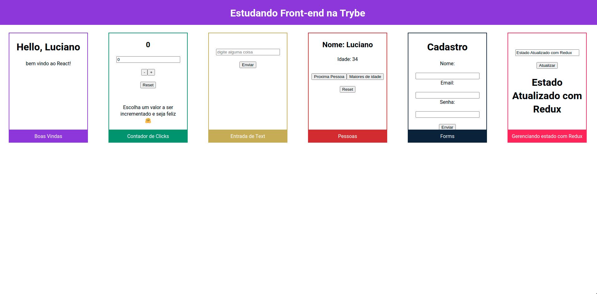

# Alguns exercícios de introdução ao React

## Aqui aprendo:

- Criar componentes
- Props
- State
## Lista de componentes

1. Componente **Card** para armazenar outros componentes.
2. Componente **Greeting** que renderiza um mensagem de saudação.
3. Componente **Counter** contador de clicks com incremento de decremento.
4. Componente **InputText** input com button que imprime um alerta com o conteúdo digitado.
5. Componente **ViewPerson** vizualiza uma lista de pessoas

